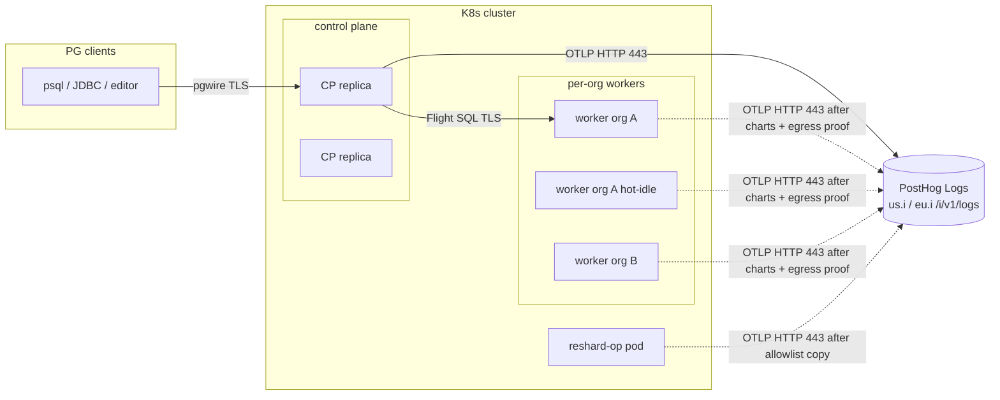

# Send control-plane and worker logs to PostHog Logs (multi-tenant)

| Field | Value |
| --- | --- |
| Status | Draft (rev 5 — leftover “SQL off OTLP” nit fixed) |
| Author | TBD |
| Date | 2026-08-17 |
| Audience | Duckgres engineers shipping the remote/k8s multi-tenant topology |
| Scope | Process-level slog → PostHog Logs via OTLP for control-plane, remote worker, and reshard-runner pods |

This is not a greenfield logging design. Duckgres already has a process-level OTLP export to PostHog Logs (`internal/cliboot/logging.go` `InitLogging`). What it does **not** have is a multi-tenant *system*: distinct `service.name` values, a stable identity schema, session-scoped context that survives worker reuse, a customer-data policy that redacts secret DDL and keeps query text off INFO (exported WARN/ERROR carry `RedactForLog`+4096 SQL), cost controls, and worker/reshard plumbing that actually turns the exporter on in the fleet.

---

## Overview

Operators debugging a managed-warehouse incident today have two log surfaces that do not join: `kubectl logs` on a specific CP or worker pod (stderr, stamped with `pod`/`node` only on that stream), and PostHog Logs if someone set `POSTHOG_API_KEY` on the **control-plane Deployment**. Remote worker pods never see that env — `controlplane/k8s_pool_spawn.go` builds an explicit env list and only forwards OTEL *trace* knobs, not `POSTHOG_*`. Every record that *does* export is labeled `service.name=duckgres` (or `duckgres-<DUCKGRES_IDENTIFIER>`), so CP, workers, and reshard runners collapse into one facet. Query text rides the same slog handler to PostHog that `POSTHOG_ANALYTICS_API_KEY` was invented to avoid.

The proposal is to keep the existing OTLP client and make it a first-class multi-tenant system:

1. Split `service.name` into `duckgres-control-plane` / `duckgres-worker` / `duckgres-reshard`.
2. Treat the attribute schema as a contract (`org`, `user`, `worker`, `pid`, `trace_id`, …) with attach/clear rules that cannot leak the previous user on a hot-idle reuse. The public connection key is the existing `pid`, not a new `connection_id`.
3. On the OTLP handler, **keep** query attrs after `usersecrets.RedactForLog` + 4096 (`DUCKGRES_POSTHOG_LOG_QUERY_TEXT=redacted`). Secret DDL is a placeholder; ordinary SELECT text and its literals **do** leave the cluster (customer data). Stderr stays useful for `kubectl` (today’s redaction). This handler **lands before or with** any `service.name` cut.
4. Default PostHog export to WARN+ERROR (stderr stays at `DUCKGRES_LOG_LEVEL`). INFO is sampled or dropped. User-class query failures stay Info (`Query execution failed.`) and **do not** export at the default — confirmed (OQ 2.A). No dedicated WARN `Query failed.` event.
5. Inject `POSTHOG_*` onto workers and reshard pods as a **named `env:` `secretKeyRef`**, never `envFrom`, never a plaintext `value:`. Missing logging env must **never** fail a worker spawn. Direct per-pod OTLP over 443, but **in-repo netpol is not proof of prod egress**.
6. `FlushLogging()` on the real `os.Exit` drain paths. This is tail-of-process insurance: `BatchProcessor` already exports on ~1s; the lines at risk are the last “shutting down / drained” records, not the incident itself.

**Operational v1 slice:** CP-only export (redact-and-keep + `service.name` + flush + schema) is a valid first enablement. Worker token distribution waits on the charts Secret (analytics project token) + confirmed egress. See Alternative D.

Product-analytics events (`internal/analytics`, `cliboot.InitAnalytics`) and the durable per-query log (`ducklake.system.query_log`) are out of scope and must stay separate.

---

## Background & Motivation

### What already exists

`cliboot.InitLogging()` (`internal/cliboot/logging.go`) is called from every entrypoint and takes **no arguments**:

- `cmd/duckgres-controlplane/main.go` (control-plane **and** reshard-runner — logging is initialized *before* the mode branch, and `DUCKGRES_MODE` is never set)
- `cmd/duckgres-worker/main.go` (sets `DUCKGRES_MODE=duckdb-service` **before** `InitLogging` — the only entrypoint that does)
- `main.go` (standalone / unified binary; mode env unset at `InitLogging`)

`BuildInfo.Log(mode)` runs **after** `InitLogging` in every entrypoint. `otelResource()` today only reads `DUCKGRES_IDENTIFIER`.

When `POSTHOG_API_KEY` is set it:

- Always writes stderr via `StampedHandler` (`pod`/`node` from `POD_NAME`/`NODE_NAME`, **stderr only**).
- Fans out to one or more `otlploghttp` exporters at `{POSTHOG_HOST}/i/v1/logs` with `Authorization: Bearer <key>`. Default host `us.i.posthog.com`. Extra keys from `ADDITIONAL_POSTHOG_API_KEYS` (experimental).
- Wraps everything in `RedactingHandler` → `server.RedactSecrets` (password=` / password: patterns) plus a key denylist for `token` only.
- Uses `sdklog.NewBatchProcessor` (async, default ~1s export interval) and a 5s `provider.Shutdown` on the returned flush func.
- Stamps the shared OTel resource from `otelResource()` (`internal/cliboot/otel_resource.go`): `service.name=duckgres` or `duckgres-<DUCKGRES_IDENTIFIER>`. **The same resource is used by traces** (`InitTracing`). A `service.name` cut is therefore also a VictoriaTraces / dashboard migration.

`POSTHOG_API_KEY` also enables product-analytics events unless `POSTHOG_ANALYTICS_API_KEY` is set (which takes precedence for events and leaves log export off). README and `cliboot/analytics.go` are explicit: application logs carry query text (`logQueryError` / `logClientQueryReceived` / `logWorkerStatement*`), and `usersecrets.RedactForLog` only rewrites secret DDL. `logQuery` itself does **not** slog — it writes `query_log` + analytics only. That split is load-bearing for a customer-data cluster.

Identity today is partial and inconsistent:

| Surface | What is stamped | Lifetime |
| --- | --- | --- |
| stderr `StampedHandler` | `pod`, `node` | process |
| OTel resource | `service.name` only | process |
| CP `handleConnection` `clog` | grows `remote_addr` → `user` → `org` → `worker`/`worker_pod` | connection |
| `clientConn.logger()` | `user`, `org`, `worker`, `worker_pod` — **no `pid`** | rebuilt each call |
| `SessionManager` | `pid`, `worker`, `user` on `Session created on worker.` / `Session destroyed.` | those two lines |
| Worker `stampWorkerLogIdentity` (`duckdbservice/activation.go`) | `org`, `worker` on **default** logger, once | process (org-reserved; sticky) |
| Worker session create/destroy | per-call `user=` on some `slog.Default()` lines | not a logger — already leak-safe |

`stampWorkerLogIdentity` is the right *org* stamp (a remote worker is assigned to one org for its life). It is **not** a user stamp — and must never become one. Remote workers are one-session-at-a-time (`DUCKGRES_DUCKDB_MAX_SESSIONS=1`) but are reused across users of that org (hot-idle). A user attr left on `slog.Default()` would leak onto the next session and onto hot-idle maintenance logs. Today’s per-call `"user"` attrs do **not** leak; the new value of a session logger is putting `user`+`pid` on **every** in-session WARN/ERROR (especially `Query appears stuck — no progress detected.`).

### Pain points in the multi-tenant fleet

1. **Workers are silent in PostHog.** Spawn env is constructed, not inherited (`k8s_pool_spawn.go`). The comment at the parquet-prefetch block already states the invariant: *“Worker pods get an explicitly-constructed env list … any flag the worker reads at startup must be mirrored through explicitly.”* `POSTHOG_API_KEY` is not mirrored. Process-backend workers *do* inherit `os.Environ()` (`controlplane/worker_mgr.go`), which is why this looks “already on” in single-host topologies.
2. **One `service.name`.** PostHog groups/facets/alerts by `service.name`. CP query-routing failures, worker engine fatals, and reshard step errors cannot be separated.
3. **SQL in the OTLP payload.** `logClientQueryReceived` and `logWorkerStatementStarted/Finished` attach `query` (secret-DDL-redacted, 4096-capped). Engine errors echo SQL (`LINE 1: <sql>`). Shipping that to a PostHog project is the reason `POSTHOG_ANALYTICS_API_KEY` exists.
4. **`pod`/`node` missing on OTLP.** `StampedHandler` puts them on stderr only. PostHog cannot filter by pod without also putting them on the resource or every record.
5. **`os.Exit` skips `defer loggingShutdown()`.** Worker SIGTERM (`duckdbservice/service.go` 963–977) and CP SIGTERM (`controlplane/control.go` 654–683) both `os.Exit`. That is a real Go gap for the *last* batch. It is **not** why operators would miss `instance invalidated` during a 55m drain — `BatchProcessor` already exports on ~1s. `FlushLogging` is tail-of-process insurance for “Shutting down / drained” lines.
6. **Volume.** Default INFO on every query (`Client query received.` + `Worker statement started.` + `Worker statement finished.` — all **CP** slog) is not viable once query text is attached. Health checks (2s) are already metric-only.
7. **Charts are a separate repo.** CP Deployment env is not automatically on worker pods. Token distribution, netpol FQDNs, and Secret refs must be designed here and landed there. In-repo `k8s/networkpolicy.yaml` 443-without-dest is **not** production Cilium.

### What this is not

- Not a replacement for `ducklake.system.query_log` (`server/querylog.go` → tenant metadata Postgres). That is the durable, queryable, per-statement audit with `query_id`, timings, and (redacted) SQL. Do not dump those rows into PostHog Logs.
- Not product analytics. Events stay on the capture API (`internal/analytics`).
- Not a log pipeline for cache-proxy (`cmd/cache-proxy` has its own slog/`service.name=duckgres-cache-proxy`). Follow-up if wanted.
- **Not a cluster-wide stdout-sanitization project.** This design does not make the cluster safe against Fluent Bit / Vector / CloudWatch scrapers of stderr (OQ 5.A). See Security.

---

## Goals & Non-Goals

### Goals

- An operator can filter PostHog Logs by `org` and `user` (including `svc_<hex>`) and see CP lines for that org. Once worker export is enabled (not required for the first operational slice), the same filter includes that org’s current *and recently retired* workers. Identifiers land in the **same PostHog project as product analytics** (OQ 1.B + 4.B).
- `service.name` is one of `duckgres-control-plane` | `duckgres-worker` | `duckgres-reshard` (standalone remains `duckgres`).
- Jump from a **system** failed query (`Query execution errored.`), DuckLake conflict, worker retire, or activation failure via `trace_id`, `pid`, `worker`, `org`. Jump from a **user-class** failed query (`Query execution failed.` at Info) is **not a v1 goal** at the default PostHog level (OQ 2.A). Those stay on `query_log` + stderr.
- Secret DDL and credentials never reach PostHog Logs. Ordinary SQL **does** leave the cluster on exported lines, as `RedactForLog` + 4096 (OQ 3.B). That is still customer data.
- Session identity attaches at create and clears on destroy/release. Hot-idle reuse and exploratory small→standard switch do not leak the previous user.
- Export stays off the query hot path (existing BatchProcessor). Failures never fail a query. Drain/shutdown flush is bounded (keep 5s) and actually runs on the listed `os.Exit` sites.
- Cost is bounded: WARN+ERROR default to PostHog; stderr unchanged; drop health-check noise; document in-product drop rules.
- Worker and reshard pods get the same export config as the CP without putting the project token in the pod spec as a plaintext `value:` — **and without failing spawn if the logging env is missing**.
- Exporter health is observable on the **CP Prometheus scrape** (including a roll-up of worker export failures via the existing health-check RPC). Workers do not serve `:9090`.

### Non-goals

- Replacing or dual-writing `ducklake.system.query_log`.
- Shipping every INFO line from every worker.
- A cluster-wide log collector as a *requirement* for v1 (evaluated; not selected).
- Changing product-analytics event schema or the `POSTHOG_ANALYTICS_API_KEY` split.
- Logging metadata-proxy SQL (the relay is opaque by contract; only session establish/close).
- Putting org IDs, tokens, or cluster names in this public repo’s examples.
- Cache-proxy → PostHog Logs (separate binary, separate image).
- Tail sampling across CP+worker traces (needs a collector). Head-sample INFO only in-process.
- Making stderr safe for an existing or future log scraper (OQ 5.A — accepted non-goal).
- Worker-local Prometheus (`InitMetrics` is intentionally CP-only).

---

## Key Decisions

1. **Keep direct per-pod OTLP as the end-state transport; do not add a collector or CP log-proxy.**  
   `InitLogging` already speaks PostHog’s native protocol. In-repo `k8s/networkpolicy.yaml` already allows 443 egress from workers, CP, and reshard pods (no dest restriction) — that covers kind/manifests tests **only**. Production Cilium/FQDN policy lives in the charts repo and is unverified here. A collector is a new DaemonSet this repo cannot land. A CP proxy would put worker log volume on the pgwire process. **First operational slice is CP-only export** (Alternative D) until charts Secret + mw-dev worker records prove egress.

2. **`service.name` is the process role, not `duckgres-<identifier>`.**  
   `DUCKGRES_IDENTIFIER` moves to resource attr `duckgres.deployment`. Traces share `otelResource()`; the cut is a **dashboard migration** for VictoriaTraces as well as PostHog Logs. Land it **in the same PR as query redaction** so we never ship a new service name that still exports unredacted-beyond-secret-DDL SQL.

3. **Default PostHog level is WARN, not INFO.**  
   `DUCKGRES_LOG_LEVEL` continues to control stderr. New `DUCKGRES_POSTHOG_LOG_LEVEL` defaults to `warn`. INFO can be enabled per cluster or head-sampled via `DUCKGRES_POSTHOG_LOG_INFO_SAMPLE` (default `0`). Errors and WARNs are never sampled. **User-class query failures stay Info** (`Query execution failed.` in `logQueryError`); they do **not** export at this default (OQ 2.A, 2026-08-17). Do **not** add a dedicated WARN `Query failed.` event and do **not** raise the CP PostHog level to Info.

4. **OTLP keeps redacted query text; stderr keeps today’s redaction.**  
   Default `DUCKGRES_POSTHOG_LOG_QUERY_TEXT=redacted` (OQ 3.B, 2026-08-17). Algorithm: snapshot original query → `RedactErrorForLog(orig, err)` → **KEEP** the query attr as `usersecrets.RedactForLog` + `boundQueryLogText` (4096). Secret DDL is a placeholder; ordinary SELECT text and its literals **do** leave the cluster. That is still customer data. Always drop `secret_statements`. **Never** redact on the substring `LINE 1:`. Values `off` (drop query attrs) and `on` (stderr-equivalent text) remain as overrides.

5. **Worker `POSTHOG_API_KEY` is a named `env:` `secretKeyRef` copied from the CP pod spec. Never `envFrom`. Never `os.Getenv` → `value:`. Never fail spawn.**  
   Charts contract: `POSTHOG_API_KEY` MUST be a first-class `env:` entry with `valueFrom.secretKeyRef` on the CP container. `envFrom` is insufficient and is not invented-around. Cache the allowlisted `EnvVar`s once at pool start from `Get(namespace, POD_NAME)`. If Get fails, `POD_NAME` is empty, or the named env is missing: one WARN (`PostHog log env not found on CP pod spec; workers will not export`) and omit the vars. **A logging-config miss must not prevent worker boot.**

6. **Org/worker identity is process-scoped; user/`pid` identity is session-scoped.**  
   Keep `stampWorkerLogIdentity` for `org`+`worker`. Never `slog.SetDefault(…With("user", …))`. Session logger lives on the worker `Session`, is used at the inventoried call sites, and is discarded in `DestroySession`.

7. **Do not use `ADDITIONAL_POSTHOG_API_KEYS` in managed-warehouse, and do not forward it to workers or reshard pods.**  
   Same host, doubles ingest, experimental. If someone sets it on the CP, only the CP dual-writes.

8. **Export stays gated on `POSTHOG_API_KEY`. Same PostHog project as product analytics; identifiers are allowed.**  
   Production US / EU / mw-dev send logs to the project that already receives product-analytics events (OQ 1.B + 4.B, 2026-08-17). Not a dedicated ops project. Not dual-write via `ADDITIONAL_POSTHOG_API_KEYS`. `org`, `user` (including `svc_<hex>`), `remote_addr`, `worker_pod`, and `pid` are exported. Anyone who can read that project's logs can see warehouse ids, usernames, client IPs, and redacted SQL — document this ACL in README. Enable once the charts Secret holds that project's token. Setting only `POSTHOG_ANALYTICS_API_KEY` still means “events, no logs.” **Workers never receive `POSTHOG_ANALYTICS_API_KEY`** (they get `POSTHOG_API_KEY` via Secret ref when export is on).

9. **`FlushLogging` is tail-of-process insurance, invoked only on the listed drain `os.Exit` sites.**  
   Do not rewrite every `os.Exit(1)` fatal. A healthy exporter already flushed the incident line on the ~1s batch interval.

10. **Attribute schema is a contract with tests. The public connection key is `pid`.**  
    Matches `SessionManager` (`Session created on worker.` / `Session destroyed.`), cancel, `pg_stat_activity`, and recent-errors. Do **not** introduce `connection_id`. Adding a high-cardinality or sensitive attr requires a test and a README row. Renames are breaking.

11. **`InitLogging` and `InitTracing` must observe the same mode and build info.**  
    Change both signatures to take `BuildInfo`: `InitLogging(bi BuildInfo) func()` and `InitTracing(bi BuildInfo) func()`. Both call `otelResource(bi)` — **one constructor, identical args**, so logs and traces cannot drift. Every entrypoint: one `bi := buildInfo()`, `os.Setenv("DUCKGRES_MODE", *mode)`, then `InitLogging(bi)` and `InitTracing(bi)` (worker, CP, both `main.go` sites). Child-mode / `duckdb-service` → `duckgres-worker`. Do not leave a no-arg `otelResource()` that traces still call.

12. **Worker exporter health is surfaced through the existing health-check RPC, then scraped on the CP.**  
    Workers do not call `InitMetrics`. Do not invent Prometheus series nobody scrapes. The health JSON grows `otlp_export_failures` (process-lifetime **monotonic** count) and `otlp_export_enabled`. The CP **does not** `Add` the absolute JSON value: it stores last-seen per worker and `Add(delta)` only (see Observability). Metric labels are `{source,reason}` only — **no `{org}`**. Absence of `service.name=duckgres-worker` in PostHog plus the CP spawn WARN is the human signal if RPC plumbing lags.

---

## Proposed Design

### Topology



Each process *can* run `InitLogging`. Correlation is by attributes + `trace_id`, not by shipping logs through the CP. Dashed worker/reshard edges are the post-charts enablement; CP-only is the first slice.

### Sequence: session attach / detach (worker)

```mermaid
sequenceDiagram
  participant CP as Control plane
  participant W as Worker process
  participant PH as PostHog Logs

  Note over W: process logger: service.name=duckgres-worker<br/>resource: pod, node, deployment
  CP->>W: ActivateTenant(org, worker)
  W->>W: stampWorkerLogIdentity(org, worker)<br/>sticky on slog.Default
  W-->>PH: activation WARN/ERROR (org, worker; no user)

  CP->>W: CreateSession(username, pid)
  W->>W: session.logger = default.With(user, pid)
  Note over W: inventoried in-session WARNs use session.Logger()
  CP->>W: statements...
  W-->>PH: WARN/ERROR with org, user, worker, pid

  CP->>W: DestroySession
  W->>W: drop session.logger; wipe secrets
  Note over W: subsequent logs have org+worker only

  CP->>W: CreateSession(other_user, ...)
  W->>W: new session.logger (other_user)
```

Exploratory escalation is the same contract: `DestroySession` on the small worker (clears user), then `CreateSession` on the standard worker (new user stamp). The CP already rebuilds `clog` with the new `worker`/`worker_pod` (`control.go` `escClog`). A dedicated `Exploratory worker escalated.` line does **not** exist today; adding it is a later, optional INFO (will not export at default WARN).

### Handler stack

`QueryStripHandler` lives **only** on the PostHog branch, inside `multiHandler`, never above it (that would strip stderr and contradict Decision 4). `RedactingHandler` stays outside the split.

```
slog.Default
  └─ RedactingHandler                 # password= / token keys  (both sinks)
       └─ multiHandler
            ├─ StampedHandler(stderr) # DUCKGRES_LOG_LEVEL; pod/node stamp
            └─ PostHog branch         # only if POSTHOG_API_KEY set
                 1. level gate        # DUCKGRES_POSTHOG_LOG_LEVEL (own Enabled)
                 2. INFO sampler      # DUCKGRES_POSTHOG_LOG_INFO_SAMPLE
                 3. drop filter       # exact message "Starting metrics server"
                 4. QueryStripHandler # snapshot → RedactErrorForLog → KEEP redacted query
                 5. otelslog → BatchProcessor → otlploghttp
```

`otelslog.NewHandler` has **no** level gate today; `multiHandler` forwards every stderr-enabled record. The PostHog branch must implement `Enabled()` independently so INFO can reach stderr and not OTLP.

Drop-filter matchers are **exact message equality** on `Starting metrics server` (`cliboot/metrics.go`). Do not substring-match “health” / “failed” — that would false-positive `Query execution failed.` and `K8s worker health check failed.`.

### `QueryStripHandler` (slog.Handler contract)

Required methods. Strip applies to both `Handle` record attrs **and** `WithAttrs` (so `logger.With("query", sql).Info("x")` cannot bake SQL into the handler). `stampWorkerLogIdentity` uses `SetDefault(Default().With(...))` with only `org`/`worker` — still goes through `WithAttrs`.

```go
type QueryStripHandler struct {
    Inner     slog.Handler
    QueryText string // "off" | "redacted" (default) | "on"
    origQuery string // snapshotted from WithAttrs; used when Handle has no query attr
}

func (h *QueryStripHandler) Enabled(ctx context.Context, l slog.Level) bool {
    return h.Inner.Enabled(ctx, l)
}

func (h *QueryStripHandler) Handle(ctx context.Context, r slog.Record) error {
    return h.Inner.Handle(ctx, stripRecord(r, h.QueryText, h.origQuery))
}

func (h *QueryStripHandler) WithAttrs(attrs []slog.Attr) slog.Handler {
    snapped := firstQueryAttr(attrs) // same keys as stripRecord step 1
    if snapped == "" {
        snapped = h.origQuery
    }
    return &QueryStripHandler{
        Inner:     h.Inner.WithAttrs(stripAttrs(attrs, h.QueryText)),
        QueryText: h.QueryText,
        origQuery: snapped, // MUST keep the original SQL, not the stripped copy
    }
}

func (h *QueryStripHandler) WithGroup(name string) slog.Handler {
    return &QueryStripHandler{Inner: h.Inner.WithGroup(name), QueryText: h.QueryText, origQuery: h.origQuery}
}
```

`WithAttrs` **must** stash `origQuery` on the child. `logger.With("query", sql).Error("failed", "error", err)` puts SQL on the handler and the error on the record. If `WithAttrs` only `stripAttrs` and forgets the snapshot, `Handle` takes the no-query fallback (`SECRET` / `password=` only) and never calls `RedactErrorForLog`. Do **not** paper over that by matching `LINE 1:`.

**`stripRecord(r, queryText, stashedQuery)` algorithm — this order is load-bearing:**

1. **Snapshot** the original query-shaped attrs from the **record** *before* mutating anything. Keys (case-sensitive, existing slog keys): `query`, `sql`, `transpiled`, `transpiled_query`, `statement`. First non-empty string value is `origQuery`. Walk `slog.KindGroup`. If the record has none, use `stashedQuery` from the handler (the `WithAttrs` snapshot). For `error` / `err` / `exception`, accept `slog.KindString` **and** `slog.KindAny` (unwrap `error` like `RedactingHandler.redactAttr`).
2. **If `origQuery` is non-empty** (record or stash), rewrite every error-shaped attr with `usersecrets.RedactErrorForLog(origQuery, errText)`. That function needs the **original un-redacted query** and only replaces the message when the query is CREATE SECRET DDL. Non-secret DuckDB errors (`Catalog Error: Table with name nope does not exist!\nLINE 1: SELECT * FROM nope`) **pass through unchanged** — the operator still sees `Catalog Error` / SQLSTATE. The `LINE 1:` clause is *not* a redaction trigger.
3. **Rewrite query-shaped attrs** according to `QueryText` (default **`redacted`**):
   - `redacted` (default): replace each query-shaped attr with `usersecrets.RedactForLog(origQuery)` then `boundQueryLogText` (4096). Secret DDL becomes the existing placeholder; ordinary SELECT text (and its literals) **remain**. This is still customer data.
   - `off`: **drop** the query-shaped attrs (identity + error class only).
   - `on`: keep the same text stderr would have (already `RedactForLog` + 4096 at the call site).
   Always **drop** `secret_statements` regardless of `QueryText`.
4. **Fallback redaction** (only when step 1 found **no** query attr **and** the stash is empty): apply `server.RedactSecrets` plus the key denylist, and replace the error text only if it matches `SECRET` as a secret-DDL token or `password=` / `password:`. **Never** match `LINE 1:`. DuckDB puts `LINE 1: <sql>` on essentially every engine error; using it as a signal would wipe the exact WARN/ERROR records PostHog is supposed to keep.

Tests (same PR as the handler; defaults assume `QueryText=redacted`):

- `TestQueryStripHandlerKeepsRedactedSelect` — ordinary `SELECT …` is **present** on the OTLP record (redacted-shape + 4096), not dropped.
- `TestQueryStripHandlerSecretDDLIsPlaceholder` — CREATE SECRET query attr is the `RedactForLog` placeholder, not the option list / credentials.
- `TestQueryStripHandlerRedactsSecretError` — CREATE SECRET error echo does not appear.
- `TestQueryStripHandlerPreservesNonSecretDuckDBError` — table-not-found still contains `Catalog Error` (and may still contain `LINE 1:`); it is **not** replaced with a redaction placeholder.
- `TestQueryStripHandlerOffDropsQuery` — with `QueryText=off`, `query`/`sql`/`transpiled` are absent; stderr still has redacted query.
- `TestQueryStripHandlerWithAttrsDoesNotLeakRawSecret` — `With("query", createSecretSQL).Info("x")` does not put credentials on the sink.
- `TestQueryStripHandlerWithAttrsRedactsLaterError` — `With("query", createSecretSQL).Error("failed", "error", errEcho)` still redacts via `RedactErrorForLog` (stash), not via a `LINE 1:` match. A non-secret `With("query", "SELECT 1").Error(..., catalogErr)` still contains `Catalog Error`. The query attr on that record is the redacted form.

Also extend `redactedKeys` (both sinks, `RedactingHandler`): `password`, `credential_secret`, `secret`, `secret_statements`, `authorization`, `aws_secret_access_key`, `session_token`. Defense in depth.

### `service.name` resolution

`InitLogging` and `InitTracing` today cannot see mode or build info. `InitTracing` (`internal/cliboot/tracing.go`) calls no-arg `otelResource()` at line 47. If only `InitLogging` grows a `BuildInfo` argument, traces keep `service.name=duckgres` / `duckgres-<identifier>` while logs split — the opposite of a shared-resource cut.

Change both:

```go
// internal/cliboot/logging.go
func InitLogging(bi BuildInfo) func()

// internal/cliboot/tracing.go
func InitTracing(bi BuildInfo) func()  // was InitTracing(); now same otelResource(bi)
```

Every entrypoint, **before** either init (`cmd/duckgres-controlplane/main.go`, `cmd/duckgres-worker/main.go`, both sites in `main.go`):

```go
bi := buildInfo()
_ = os.Setenv("DUCKGRES_MODE", *mode) // control-plane | duckdb-service | reshard-runner | standalone
loggingShutdown := cliboot.InitLogging(bi)
tracingShutdown := cliboot.InitTracing(bi)
```

Pass the **same** `bi` value into both. Both providers call `otelResource(bi)` — one constructor, identical args. Do not leave a no-arg `otelResource()` overload that traces still hit. `cmd/cache-proxy` has its own resource (`service.name=duckgres-cache-proxy`) and is out of scope.

`cmd/duckgres-worker` already sets `DUCKGRES_MODE=duckdb-service` before `InitLogging`. CP and all-in-one must start doing so (including `--mode reshard-runner`). Child-mode / process-backend workers already force `DUCKGRES_MODE=duckdb-service` (`worker_mgr.go`).

`otelResource(bi BuildInfo)` maps:

| `DUCKGRES_MODE` | `service.name` |
| --- | --- |
| `control-plane` | `duckgres-control-plane` |
| `duckdb-service` | `duckgres-worker` |
| `reshard-runner` | `duckgres-reshard` |
| unset / `standalone` / other | `duckgres` |

- `OTEL_SERVICE_NAME` overrides if set (escape hatch; not used in managed-warehouse).
- `DUCKGRES_IDENTIFIER`, if set, becomes `duckgres.deployment` (and `deployment.environment` only if it is exactly one of `dev|staging|production`). It no longer suffixes `service.name`.
- Resource also gains: `service.version` from `bi.Version`, `service.instance.id`=`POD_NAME`, `k8s.pod.name`, `k8s.node.name`, `k8s.namespace.name` from `POD_NAMESPACE`.
- Inject `POD_NAMESPACE` via the Downward API (`metadata.namespace`) next to the existing `POD_NAME` / `NODE_NAME` stamps in `k8s_pool_spawn.go` and `reshard_pod.go`. Omit the attr if unset (non-k8s).

`otelslog.NewHandler("duckgres", …)` is the OTel *logger name*, not `service.name`. Leave it; do not confuse the two in docs.

### Session / connection identity

**Public name is `pid`.** `SessionManager` already emits it. `clientConn.logger()` does not include it today — that is the join bug, not a missing `connection_id`.

**Control plane** — extend `clientConn.logger()` (`server/conn.go`) to always include:

- existing: `user`, `org`, `worker`, `worker_pod`
- add: `pid` (= `c.pid`, the backend-key pid used by cancel / `pg_stat_activity` / recent-errors / `Session created on worker.`)
- add: `query_source` when set
- keep `query_id` / `trace_id` on the query-boundary records only

`handleConnection`’s `clog` adds `pid` as soon as it is allocated so pre-session lines (auth failure, admission reject) still join.

**Worker** — two layers:

| Attr | Where | Set | Cleared |
| --- | --- | --- | --- |
| `org`, `worker` | `stampWorkerLogIdentity` on default logger | first successful `ActivateTenant` | never (pod dies or is retired) |
| `user`, `pid` | `Session.logger` | `CreateSession` | `DestroySession` (object dropped) |

```go
// duckdbservice/session_log.go
func (p *SessionPool) attachSessionLog(s *Session, username string, pid int32) {
    attrs := []any{"user", username}
    if pid > 0 {
        attrs = append(attrs, "pid", pid)
    }
    s.logger = slog.Default().With(attrs...)
}

func (s *Session) Logger() *slog.Logger {
    if s == nil || s.logger == nil {
        return slog.Default() // org+worker only; safe for hot-idle
    }
    return s.logger
}
```

`WorkerCreateSessionPayload` gains optional `pid` (`json:"pid,omitempty"`). Land this **with the first consumer** (stuck-query WARN), not as a proto-only change. Missing/zero is allowed (older CP / tests).

**Hard rule:** no `slog.SetDefault(slog.Default().With("user", …))`. That is the leak tripwire. Per-call `"user"` on `slog.Default()` is already leak-safe and may remain on Create/Destroy debug lines.

#### Worker slog inventory (`duckdbservice/`)

Every `slog.*` that can run while a session exists, marked.

| Site | Message (exact / pattern) | Use |
| --- | --- | --- |
| `flight_handler.go` ~440 | `Query appears stuck — no progress detected.` | **`session.Logger()`** — highest-value in-session WARN; test that it carries `user`+`pid` |
| `service.go` 748, 775, 780, 783 | idle txn rollback / skip / fail | **`session.Logger()`** |
| `service.go` 808 | `Reaping abandoned query handle (no DoGet).` | **`session.Logger()`** |
| `service.go` 1197, 1202 | Failed to set initial memory_limit / threads | `session.Logger()` once attached; else per-call `user` is fine (create path) |
| `service.go` 1224, 1241 | secret hygiene / wiped previous secrets | per-call `user` on Default is OK (create path; no prior session logger) |
| `service.go` 1138–1148, 1252, 1304 | Debug create-session | Default + per-call `user` (DEBUG; not exported) |
| `service.go` 1400–1458, 1432, 1443 | destroy / wipe / restore S3 | last use of `session.Logger()`, then drop |
| `service.go` 1801, 1805 | search_path | `session.Logger()` if session exists |
| `user_secrets.go` 108, 113 | replay fail / replayed | `session.Logger()` if session exists; else per-call `user` |
| `copy_from_stdin.go` 266 | copy-from-stdin debug | `session.Logger()` |
| `transient.go` 119–231 | DuckLake retry / conflict / exhausted | `session.Logger()` when the retry is on a session conn; else Default |
| `instance_fatal.go` 154 | `DuckDB instance invalidated by a fatal engine error; worker must be retired.` | **Default** (process-wide; org+worker is the identity) |
| `instance_fatal.go` 221 | liveness probe stuck | **Default** |
| `activation.go` 257, 378 | S3 swap / refresh | **Default** (`org` already) |
| `cache_proxy.go`, `cache_proxy_router.go` | cache proxy lifecycle | **Default** (process) |
| `commit_stats.go`, `querylog.go`, `duckdb_pair.go` | process / sink | **Default** |
| `service.go` warmup / listen / drain / shutdown | process lifecycle | **Default** |

PR 3 is not done if `Session.logger` exists but `Query appears stuck` still uses `slog.Default()` without `user`/`pid`. Required test: `TestStuckQueryWarnCarriesSessionIdentity`.

**Hot-idle / retire / drain.** Maintenance uses `slog.Default()` → `org`+`worker`, no `user`.

**Exploratory switch.** No new required message. Optional later INFO will not export at default WARN.

**Metadata proxy.** Existing lines (`Metadata proxy session established.` / `Metadata proxy session closed.` / `Metadata proxy relay ended.`, `controlplane/metadata_proxy.go`) already carry `org`/`user`. Add `pid` if a pid is allocated. Do **not** invent query attrs.

**Service credentials.** Username is `svc_<hex>`. Log it as `user`. Never log `credential_secret`. `user` is exported (OQ 4.B).

**Passthrough users.** Still have `org`/`user`/`pid`. No change.

### Wide events

Split “exists today (exact string)” vs “add later”. Default PostHog level = WARN (OQ 2.A), so INFO rows are stderr-only unless an operator raises the level or sets an INFO sample. User-class failures stay Info — **not** promoted.

#### Exists today (exact message)

| Message | Level | Who | File | Default OTLP |
| --- | --- | --- | --- | --- |
| `Connection accepted.` | INFO | CP | `control.go` `handleConnection` (`clog.Info`) | drop (level) |
| `Connection rejected.` | WARN | CP | `control.go` | **keep** |
| `User authenticated.` | INFO | CP | `control.go` 1147 | drop (level) |
| `Failed to create session.` | ERROR | CP | `control.go` | **keep** |
| `Session created on worker.` | INFO | CP | `session_mgr.go` 599 (`pid`,`worker`,`user`,…) | drop (level) |
| `Session destroyed.` | INFO | CP | `session_mgr.go` 709 | drop (level) |
| `Client query received.` | INFO | CP | `conn.go` `logClientQueryReceived` (has `query`) | drop (level). If INFO is enabled: **keep redacted** `query`, do not drop the line by filter |
| `Worker statement started.` | INFO | **CP** | `server/worker_statement.go` (not the worker process) | drop (level). If INFO enabled: **keep redacted** `query` |
| `Worker statement finished.` | INFO | **CP** | same; stays Info **even on error** | drop (level). The leveled failure is `logQueryError`, not this line |
| `Query execution failed.` | INFO | CP | `conn.go` `logQueryError` category `user` | drop (level). **Confirmed OQ 2.A** — not a v1 PostHog line |
| `DuckLake transaction conflict.` | WARN | CP | `logQueryError` category `conflict` | **keep**, query attr = redacted shape |
| `DuckLake metadata connection lost during transaction.` | WARN | CP | `logQueryError` | **keep**, query attr = redacted shape |
| `Query execution errored.` | ERROR | CP | `logQueryError` default | **keep**, query attr = redacted shape |
| `K8s worker health check failed.` | WARN | CP | `k8s_pool_lifecycle.go` | **keep** |
| `K8s worker DuckDB instance invalidated by a fatal engine error; retiring worker.` | ERROR | CP | same | **keep** |
| `DuckDB instance invalidated by a fatal engine error; worker must be retired.` | ERROR | worker | `instance_fatal.go` | **keep** (once worker export is on) |
| `Query appears stuck — no progress detected.` | WARN | worker | `flight_handler.go` | **keep** (once worker export is on; must carry `user`+`pid`) |
| `Metadata proxy session established.` | INFO | CP | `metadata_proxy.go` | drop (level) |
| `Metadata proxy session closed.` / `Metadata proxy relay ended.` | INFO | CP | same | drop (level) |
| `Starting metrics server` | INFO | CP | `cliboot/metrics.go` | **drop-filter** (exact message), even if INFO is enabled |
| `Draining DuckDB service before shutdown.` / `Shutting down DuckDB service...` | INFO | worker | `service.go` | drop (level); `FlushLogging` may still push the last one |
| `DuckDB service drain timed out before shutdown.` | WARN | worker | `service.go` | **keep** |

Workers do **not** emit `Session created on worker.` / `Session destroyed.` — those are CP `SessionManager` lines. Do not add worker-side duplicates in v1.

#### Add later (not required for v1)

| Message | Level | Notes |
| --- | --- | --- |
| `Exploratory worker escalated.` | INFO | does not exist; `escClog` only. Will not export at default WARN |

Do **not** add a second “query completed” INFO on the OTLP path that duplicates `ducklake.system.query_log`.

Demote / do not add:

- Successful health checks — already metric-only (`observeHealthCheck`, 2s). **Do not add slog.**
- Per-statement worker-process lifecycle of statements — those logs live on the **CP** (`worker_statement.go`).
- LB TCP probes that disconnect before startup (`Client closed connection before sending startup message.` is already DEBUG).

### Sampling & level split

```
DUCKGRES_LOG_LEVEL              # stderr: debug|info|warn|error  (existing, default info)
DUCKGRES_POSTHOG_LOG_LEVEL      # OTLP:   same enum              (new, default warn)
DUCKGRES_POSTHOG_LOG_INFO_SAMPLE# 0.0–1.0, only applies to INFO  (new, default 0)
```

Sampler is deterministic per-process RNG (or hash of `trace_id` when present so CP+worker INFO for the same request either both keep or both drop). WARN/ERROR ignore the sample.

In-PostHog drop rules (operator-configured, documented in README; not code):

- Drop `service.name=duckgres-control-plane` + body equals `Starting metrics server` (belt; code already drop-filters).
- Rate-limit `duckgres-worker` INFO if someone turns INFO on in a large fleet.
- Never drop ERROR from `duckgres-worker` (instance invalidation, drain timeout).

### Worker / reshard config injection

**Hard charts contract.** `POSTHOG_API_KEY` on the CP container MUST be:

```yaml
- name: POSTHOG_API_KEY
  valueFrom:
    secretKeyRef:
      name: duckgres-posthog   # or the existing CP env Secret
      key: api-key
```

`envFrom` is **rejected as insufficient**. A Pod GET returns the submitted spec, not the resolved runtime env; `envFrom` keys do not appear in `spec.containers[0].env`. We will not `os.Getenv` the token and write it as `value:` (Decision 5). Unit test: fake CP pod with **only** `envFrom` → worker pod has **no** `POSTHOG_API_KEY` at all (not a invented `value:`).

**`K8sWorkerPool` does not have `selfPodName` today.** `cpID` is `cfg.K8s.ControlPlaneID` or `POD_NAME` or **hostname** (`multitenant.go`); Get on hostname fails. Reshard uses `POD_NAME` then `cpID` as last resort.

Implementation:

1. Extract a shared helper (prefer extending the reshard verbatim-copy, not a second implementation) that, given `[]corev1.EnvVar` and an allowlist, DeepCopies matching entries.
2. At **pool start** (once), `clientset.CoreV1().Pods(namespace).Get(ctx, os.Getenv("POD_NAME"), …)`. Cache the allowlisted `EnvVar`s. SecretKeyRef is resolved live when the **worker** pod starts; no refresh loop.
3. If `POD_NAME` is empty or Get fails: `slog.Warn("PostHog log env not found on CP pod spec; workers will not export.")` and cache empty. **Never fail spawn. Never fail pool start.**
4. `workerPodEnv(...)` (extract if needed so it is unit-testable) appends the cached PostHog `EnvVar`s plus existing env. `POSTHOG_API_KEY`: copy only if it is `valueFrom.secretKeyRef`; if it is a literal `value:`, skip and WARN once (`refusing to materialize POSTHOG_API_KEY as a pod spec value`).
5. Non-secret knobs (`POSTHOG_HOST`, `DUCKGRES_POSTHOG_LOG_LEVEL`, `DUCKGRES_POSTHOG_LOG_INFO_SAMPLE`, `DUCKGRES_POSTHOG_LOG_QUERY_TEXT`, `DUCKGRES_IDENTIFIER`) may be copied as `value:` or `valueFrom`.
6. Add `POD_NAMESPACE` Downward API next to `POD_NAME` / `NODE_NAME`.

Allowlist (workers **and** reshard — **no** `ADDITIONAL_POSTHOG_API_KEYS`, **no** `POSTHOG_ANALYTICS_API_KEY`):

```
POSTHOG_API_KEY
POSTHOG_HOST
DUCKGRES_POSTHOG_LOG_LEVEL
DUCKGRES_POSTHOG_LOG_INFO_SAMPLE
DUCKGRES_POSTHOG_LOG_QUERY_TEXT
DUCKGRES_IDENTIFIER
```

`--k8s-worker-secret` remains the **per-worker RPC** secret (`bearer-token`, `tls.crt`, `tls.key`). Do **not** stuff the PostHog token into every per-pod RPC secret.

`--k8s-worker-configmap` is the shared `duckgres.yaml` (`shared_startup_config.go` closed key set). Do **not** put tokens there.

OTEL **trace** knobs stay as today’s `os.Getenv` → `Value:` (a collector URL, not `phc_…`).

There are **no** existing `k8s_pool_spawn` env unit tests. The PR that first reads the CP pod **creates** that harness (`TestWorkerSpawnPostHogEnvIsSecretRef`, `TestWorkerSpawnOmitsPostHogWhenCPHasOnlyEnvFrom`, `TestWorkerSpawnSucceedsWhenCPPodGetFails`). Reshard already has `TestSpawnReshardPodSpec` — extend it for the new allowlist names.

**Charts repo (follow-up PR, cannot land here):**

- Secret `duckgres-posthog` (or extend the existing CP env Secret) with key `api-key`.
- CP Deployment: **named** `POSTHOG_API_KEY` `secretKeyRef` (not `envFrom`); `POSTHOG_HOST` per region; `POSTHOG_ANALYTICS_API_KEY` is a **separate** key, not copied to workers.
- Do not set `POSTHOG_API_KEY` on a worker template — the CP spawn path injects it.
- If production Cilium is FQDN-based, allow `us.i.posthog.com` / `eu.i.posthog.com` `:443` from `app=duckgres-control-plane`, `app=duckgres-worker`, `app=duckgres-reshard`.
- In-repo `tests/manifests` keep asserting 443 on all three policies. That is **not** proof prod workers can reach PostHog.

### Shutdown / drain flush

`sdklog.NewBatchProcessor` already exports on an interval (~1s). Instance-invalidated / session-destroyed lines during a 55m drain will usually have left the process long before `os.Exit`. The lines actually at risk are the last `Shutting down DuckDB service...` / `All pgwire connections drained before shutdown.` / `Old control plane exiting after upgrade.` records.

`FlushLogging()` is idempotent (`sync.Once`) and safe when export is disabled. Exporter errors go to stderr via `fmt.Fprintf`, never `slog`.

**Call sites (only these):**

| Site | File | Why |
| --- | --- | --- |
| Worker drain **success** | `duckdbservice/service.go` ~975, before `os.Exit(0)` after `Shutdown()` | last shutdown INFO |
| Worker drain **timeout** | `service.go` ~972, `CloseAll(); FlushLogging(); os.Exit(0)` — **no** `Shutdown()` today | same; flush **after** `CloseAll` so teardown logs still export |
| CP SIGTERM after `drainAndShutdown` / `shutdown` | `control.go` ~683, before `os.Exit(0)` | last drain lines |
| `drainAfterUpgrade` | `control.go` ~2748, before `os.Exit(0)` | `Old control plane exiting after upgrade.` |

Do **not** wrap every `os.Exit(1)` fatal at startup (`control.go` 344–627, worker listen failures). Those processes never had a useful batch, and `defer loggingShutdown()` on the entrypoint already runs if the fatal goes through `fatal()` in `cmd/duckgres-controlplane` (that helper *does* call `loggingShutdown()` before `os.Exit`). The SIGTERM goroutine and `drainAfterUpgrade` do not.

Do not block drain on a wedged exporter beyond 5s.

### Multi-region

| Cluster | `POSTHOG_HOST` | Project |
| --- | --- | --- |
| US managed-warehouse | `us.i.posthog.com` | **same project as product analytics** (OQ 1.B) |
| EU managed-warehouse | `eu.i.posthog.com` | **same project as product analytics** for that region (OQ 1.B; EU residency still means the EU analytics project) |
| mw-dev | `us.i.posthog.com` (likely) | **same as mw-dev analytics**, never a prod project |

Do not point US workers at the EU host or vice versa. `ADDITIONAL_POSTHOG_API_KEYS` cannot set a per-key host today; do not “fix” that to dual-write regions.

---

## Log attribute schema contract

### Resource attributes (process, set at `InitLogging`)

| Attr | Type | Example | Cardinality | Notes |
| --- | --- | --- | --- | --- |
| `service.name` | string | `duckgres-control-plane` | 4 values | role; see mapping above |
| `service.version` | string | `1.2.3` / `dev` | #builds | from `BuildInfo` passed into `InitLogging` |
| `service.instance.id` | string | pod name | #pods | `POD_NAME` |
| `k8s.pod.name` | string | same | #pods | omit if unset (non-k8s) |
| `k8s.node.name` | string | node | #nodes | `NODE_NAME` |
| `k8s.namespace.name` | string | `duckgres` | #ns | `POD_NAMESPACE`; inject Downward API; omit if unset |
| `duckgres.deployment` | string | `mw-dev` | #clusters | from `DUCKGRES_IDENTIFIER`; omit if unset |
| `duckgres.mode` | string | `duckdb-service` | 4 | raw `DUCKGRES_MODE` |

Do **not** put `org` on the resource. A worker’s org is assigned at activation, after `InitLogging`. Resource is immutable for the LoggerProvider lifetime. Org is a record attr (sticky via `With` on the default logger after activation).

### Record attributes (per log)

| Attr | Type | Who sets | When set | When cleared | Cardinality | OTLP |
| --- | --- | --- | --- | --- | --- | --- |
| `org` | string | CP `clog` / `clientConn.logger`; worker `stampWorkerLogIdentity` | CP: after SNI/auth; worker: activation | CP: conn end; worker: never (pod) | #orgs | keep (OQ 4.B) |
| `user` | string | CP logger; worker `Session.logger` | after auth / CreateSession | DestroySession / conn end | #users | keep (OQ 4.B) |
| `worker` | int | both | assign / activate | worker process (sticky); CP conn (updates on escalate) | #workers | keep; existing name, **not** `worker_id` |
| `worker_pod` | string | CP | assign / escalate | conn end | #pods | keep |
| `pid` | int | CP `c.pid` / `SessionManager`; worker from payload | pid alloc / CreateSession | destroy | #conns (high, short-lived) | keep. **Not** `connection_id` |
| `trace_id` | string | query-boundary logs | query span | n/a | high | keep |
| `query_id` | string | `logQueryError` et al. | statement | n/a | high | keep |
| `query_source` | string | CP | if GUC set | conn end | 2 (`standard`/`endpoints`) | keep |
| `query` / `sql` / `transpiled` | string | query logs | statement | n/a | unbounded / customer SQL | **keep redacted** (default `redacted`; OQ 3.B). `off` drops; `on` = stderr text |
| `error` | string | failures | failure | n/a | medium | keep, via `RedactErrorForLog` when a query attr was snapshotted |
| `error_code` | string | SQLSTATE | failure | n/a | ~50 | keep |
| `duration_ms` | int | finish lines | finish | n/a | unbounded numeric | keep |
| `remote_addr` | string | CP accept | accept | n/a | high (IPs) | keep on CP (OQ 4.B); do not add to worker |
| `scope` | string | `client` / `worker` | existing | n/a | 2 | keep |
| `token` | string | should not exist | — | — | — | `[REDACTED]` |

Use existing keys (`org`, `user`, `worker`, `worker_pod`, `pid`). Do not rename to `org_id` / `worker_id` / `connection_id`.

Cardinality note: high-cardinality `pid` / `trace_id` is fine. `query` is present on exported WARN/ERROR lines (redacted); do not treat it as a low-cardinality facet.

---

## Volume / cost estimate

**Illustrative, not measured.** The 3-INFO-lines-per-successful-query count is correct for **CP slog** (`Client query received.` + `Worker statement started.` + `Worker statement finished.`). `logQuery` does not slog. Health-check interval is 2s (`control.go`). PostHog list price and free-tier GB were **not** re-verified for this revision; do not operate a budget on the dollar line.

| Symbol | Assumed value | Status |
| --- | --- | --- |
| CP replicas | 3 | assumed |
| Worker pods (hot + hot-idle) | 200 | assumed |
| Cluster-wide user QPS | 20 (stress case 100) | assumed |
| Mean stripped log line | ~600 B | assumed |
| Mean line with 4 KiB query text | ~3 KiB | assumed |
| INFO lines per successful query | 3, all on the CP | **verified in code** |

**Qualitative conclusion (the only one this table supports):**

- 100% INFO **with** query text at even moderate QPS is not a viable default (order of 10² GB/month at 20 QPS, ~TB/month at 100 QPS).
- Default WARN+ERROR + **redacted** query (OQ 2.A + 3.B) stays cheap: only conflicts and infra errors carry up-to-4 KiB query text. User-class failures stay Info and do not export.
- Raising PostHog level to Info, or attaching redacted SQL to every successful query, re-opens volume linearly with QPS — not the default.

**Health checks:** 200 workers × 0.5 Hz = 100 RPCs/s. Metric-only today. Keep it that way.

**Retention:** PostHog default is documented as 14 days; durable SQL audit is `query_log`, not PostHog.

---

## API / Interface Changes

No public HTTP/pgwire API changes. Env / slog / spawn / health-check JSON only.

### New / changed env

| Name | Default | Consumed by | Purpose |
| --- | --- | --- | --- |
| `POSTHOG_API_KEY` | unset (export off) | all processes that have it | existing gate; workers only via secretKeyRef copy |
| `POSTHOG_HOST` | `us.i.posthog.com` | all | existing |
| `POSTHOG_ANALYTICS_API_KEY` | unset | **CP only** | unchanged; **never** copied to workers |
| `ADDITIONAL_POSTHOG_API_KEYS` | unset | **CP only** | experimental; **not** on the worker/reshard allowlist |
| `DUCKGRES_POSTHOG_LOG_LEVEL` | `warn` | all | OTLP level |
| `DUCKGRES_POSTHOG_LOG_INFO_SAMPLE` | `0` | all | INFO keep fraction |
| `DUCKGRES_POSTHOG_LOG_QUERY_TEXT` | `redacted` | all | `off` / `redacted` / `on` |
| `DUCKGRES_IDENTIFIER` | unset | all | now `duckgres.deployment`, not `service.name` suffix |
| `DUCKGRES_MODE` | set by entrypoints **before** `InitLogging` | all | drives `service.name` |
| `OTEL_SERVICE_NAME` | unset | all | optional override |
| `POD_NAMESPACE` | Downward API | all k8s processes | `k8s.namespace.name` |

### Code interfaces

```go
// internal/cliboot/logging.go
func InitLogging(bi BuildInfo) func()  // now takes BuildInfo; sets resource via otelResource(bi)
func FlushLogging()                    // new; idempotent 5s flush for listed os.Exit paths

// internal/cliboot/tracing.go
func InitTracing(bi BuildInfo) func()  // same otelResource(bi) as InitLogging; was no-arg
```

// server/wire/worker_proto.go — land WITH the first consumer (stuck-query WARN)
type WorkerCreateSessionPayload struct {
    WorkerControlMetadata
    Username         string   `json:"username"`
    MemoryLimit      string   `json:"memory_limit"`
    Threads          int      `json:"threads"`
    SecretStatements []string `json:"secret_statements,omitempty"`
    PID              int32    `json:"pid,omitempty"` // existing public name
}
```

`clientConn.logger()` and `clog` grow `pid`. Worker `Session` grows `logger *slog.Logger` and the inventoried call sites switch.

Health-check JSON (`duckdbservice/flight_handler.go` + `controlplane/worker_mgr.go` `healthCheckResult`):

```json
{
  "healthy": true,
  "instance_invalidated": false,
  "otlp_export_enabled": true,
  "otlp_export_failures": 3
}
```

The worker field is a **process-lifetime monotonic** count (starts at 0, only increases, resets only when the worker process restarts). The CP must **not** `Add` that absolute value on every 2s health tick.

Roll-up algorithm (per assigned worker id, on the CP):

1. Store `lastSeen[workerID]` (missing = not yet seen).
2. On each health JSON with `otlp_export_failures = n` (omit / old worker → skip, do not invent 0 then spike):
   - If `workerID` is new: `lastSeen[workerID] = n`; `Add(n)` (the failures that already happened on this process).
   - If `n >= lastSeen[workerID]`: `Add(n - lastSeen[workerID])`; `lastSeen[workerID] = n`.
   - If `n < lastSeen[workerID]`: treat as a **worker process restart** (counter reset). Set `lastSeen[workerID] = 0`, then `Add(n)`. Do **not** `Add(negative)`. Do **not** `Add(n)` on top of the stale last (that would double-count). Equivalently: `Add(n)` and `lastSeen = n`.
3. On worker delete / forget: drop `lastSeen[workerID]`. The next pod with that id (ids are not reused while a last-seen exists; if they are, the `n < last` branch handles it).

Metric: `duckgres_otlp_log_export_failures_total{source="cp"|"worker",reason}`. **No `{org}` label.** `source="cp"` has no org; adding `{org}` only on the worker series would split the label set. Derive org from the worker assignment in logs/alerts, not as a metric label. Worker path uses `reason="worker"` until a class is plumbed.

### Docs that must move with the code (same PR as the behavior)

- `README.md` PostHog Logging section + env table (~410–478)
- `CLAUDE.md` load-bearing: worker env allowlist, named-EnvVar-not-envFrom, never fail spawn, no user on default logger, query-redact algorithm (keep redacted `query`; `WithAttrs` stash), `pid` not `connection_id`, flush sites, `InitLogging(bi)` **and** `InitTracing(bi)` sharing `otelResource(bi)`, same-project-as-analytics ACL
- `tests/mw-dev/README.md`: e2e asserts plumbing, not ingest; why ingest cannot be asserted in-Job (same reason as analytics)

---

## Data Model Changes

None in the config store, goose migrations, or `ducklake.system.query_log`.

Health-check JSON gains two optional fields (forward-compatible; old CPs ignore unknown keys; old workers omit them → CP treats as “unknown, not a scrape failure”).

PostHog side: the attribute schema above *is* the data model. Treat renames as breaking.

---

## Alternatives Considered

### A. Direct per-pod OTLP (end-state transport)

**How:** each CP / worker / reshard process runs today’s `otlploghttp` exporter.

**Pros:** already implemented; no new component; BatchProcessor is off the hot path; worker isolation matches the one-session-per-pod model; secret is a Secret ref, not a DaemonSet scrape of stdout (which would include SQL).

**Cons:** every pod needs 443 to `*.i.posthog.com`; token must be distributed to every worker (Secret ref, not Value); no cross-pod tail sampling; N exporters vs 1 collector.

**Netpol:** in-repo policies already allow 443. Production Cilium is unverified. First proof is an mw-dev worker record in the **dev** project, not the manifests test.

### B. Cluster collector / Fluent Bit / Vector DaemonSet scraping stdout

**How:** leave `POSTHOG_API_KEY` unset in the app; ship stderr to a DaemonSet.

**Pros:** one egress identity; central tail sampling; workers never see the token.

**Cons:** stderr is **not** JSON; query text **is** there — scraping it re-introduces the SQL leak. New DaemonSet is charts-only. Fragile logfmt parsing.

**Verdict:** future if Cilium forbids worker→PostHog. Requires stderr JSON **and** stderr strip first. OQ 5.A: this design does **not** sanitize stdout; do not scrape today’s stderr into PostHog.

### C. Workers ship logs to the CP; CP exports

**How:** worker slog → Flight action → CP `InitLogging`.

**Pros:** workers need no PostHog token and no 443 to the internet.

**Cons:** shares Flight with queries or needs a new port; CP becomes a log aggregator; drain-token nightmare; blast radius includes query serving.

**Verdict:** rejected.

### D. CP-only export as the first operational slice (accepted)

**How:** ship redact-and-keep + `service.name` + `pid` on CP loggers + `FlushLogging` + schema. Enable `POSTHOG_API_KEY` on the CP Deployment only (analytics project token). Do **not** distribute the token to workers until the charts Secret exists **and** mw-dev shows `service.name=duckgres-worker` records.

**Pros:** removes Issues 3/4/10 from the critical path to *some* production value. CP `clog` / `clientConn.logger()` / `SessionManager` already stamp `org`, `user`, `worker`, `worker_pod`, and (after PR 3) `pid`. Many incident classes (auth, admission, session create/destroy, `Query execution errored.`, health-check fail, retire) are already CP lines. No worker egress, no worker Secret, no worker exporter scrape.

**Cons:** this is not the “works really well” end state. These lines live **only** on the worker today and are invisible in PostHog under D:

- `DuckDB instance invalidated by a fatal engine error; worker must be retired.` (`instance_fatal.go`) — CP has a *retire* line, but the originating redacted reason is richer on the worker, and pre-retire worker WARNs are not on the CP.
- `Query appears stuck — no progress detected.` (`flight_handler.go`)
- secret wipe / replay failures, idle-txn rollback, cache-proxy bypass, drain timeout

Operators can still `kubectl logs` the `worker_pod` the CP already stamps. D is a **slice**, not a substitute. It is the default enablement order (Rollout steps 1–2). Worker export remains in scope for this design and lands when charts + egress are real.

**Verdict:** accepted as phase 0. Do not shrink the design to D permanently.

### Why not “just set `POSTHOG_API_KEY` on the CP Deployment”

That is the current state. It exports CP logs only, all as `service.name=duckgres`, **with unredacted-beyond-secret-DDL SQL**, at INFO. Alternative D plus this design’s redact-and-keep/`service.name`/`pid`/WARN default is what makes CP-only actually usable.

---

## Security & Privacy Considerations

This is a **customer-data export into the product-analytics PostHog project** (OQ 1.B + 3.B + 4.B). Anyone who can read that project's logs — product, growth, or a broader ACL than on-call — can see warehouse ids (`org`), usernames (`user`, including `svc_<hex>`), client IPs (`remote_addr`), worker pod names, `pid`, and **redacted-shape SQL** (ordinary SELECT text and its literals; secret DDL is a placeholder). Document this ACL implication in `README.md` next to the PostHog Logging section. Do not build per-org log routing; project membership is the ACL.

| Threat | Severity | Mitigation |
| --- | --- | --- |
| Ordinary SQL / literals in PostHog | Accepted | Default `redacted`: `RedactForLog` + 4096 on exported lines. Secret DDL is a placeholder. Ordinary SELECT **does** leave. Snapshot-then-`RedactErrorForLog`; never `LINE 1:`. |
| `CREATE SECRET` / STS in logs | High | `RedactForLog` / `RedactErrorForLog`; key denylist; never log activation/CreateSession payloads |
| PostHog token in worker pod spec | High | named `secretKeyRef` only; refuse literal `value:`; refuse to invent from `envFrom`; not in ConfigMap or RPC secret |
| Previous user’s identity on next session | High | user only on `Session.logger`; `SetDefault(user)` test; inventory |
| Exporter error handler `slog.Error` recursion | Med | `fmt.Fprintf(os.Stderr)` + CP metric; never slog inside export callback |
| Broader-than-on-call ACL reads tenant identifiers + SQL | Accepted | Same project as product analytics (user decision 2026-08-17). README documents who can see what. |
| Metadata-proxy SQL leaking | Low | do not add query logging on that path |
| Existing/future stdout scrapers ship stderr SQL | Accepted | **This design does not fix that** (OQ 5.A). Non-goal. |
| Public repo leakage | — | examples use `<org-id>`, `phc_…`, `us.i.posthog.com` only |

---

## Observability

### Of the product

- Filter `service.name` + `org` + `user` + `worker` + `pid` + `trace_id`.
- Alerts on ERROR rate per `service.name` / per `org` (in-product).
- Patterns on worker retire / instance invalidated / session create failure.

### Of the exporter itself

Workers **do not** serve Prometheus (`InitMetrics` comment: they would fight over `:9090`). Any counter that exists only in a worker process is invisible.

| Signal | Where it lives | Notes |
| --- | --- | --- |
| `duckgres_otlp_log_export_failures_total{source="cp"\|"worker",reason}` | **CP** `:9090` | Labels **only** `{source,reason}` — no `{org}`. CP exporter: local `otel.SetErrorHandler` (`reason` closed enum). Worker exporter: last-seen **delta** of health JSON `otlp_export_failures` (monotonic; restart = treat last as 0 then `Add(n)`). Worker `reason="worker"` until a class is plumbed. |
| `duckgres_otlp_log_records_dropped_total` | **CP only** | CP batch drops. Do not claim a worker series. |
| `duckgres_otlp_log_enabled` | **CP only** | 1 if this CP process has a live exporter. |
| Health JSON `otlp_export_enabled`, `otlp_export_failures` | worker → CP | `failures` is process-lifetime monotonic. Old workers omit the fields (CP skips). |
| stderr `fmt.Fprintf` | each process | 1/min rate limit; after activation may include `org` on the worker. Not a scrape. |
| Human: absence of `service.name=duckgres-worker` in PostHog | PostHog UI | the v1 detection if health JSON lags. Plus CP spawn WARN if Secret ref was not copied. |

Do **not** export these signals to PostHog Logs. A failed exporter must not slog on the OTLP path.

Rollout detection for “Cilium denies worker→PostHog”: (1) enable one canary org’s workers after charts, (2) look for `duckgres-worker` in the **dev** project, (3) look at CP `duckgres_otlp_log_export_failures_total{source="worker"}` once health JSON is plumbed. Do not look at a worker `:9090`.

---

## Rollout Plan

1. **Code defaults keep export off** until the charts Secret is set. Ship redact-and-keep + `service.name` + `pid` + `FlushLogging` with no fleet change. **Query redaction lands in the same cliboot PR as the `service.name` cut.**
2. **mw-dev, CP-only (Alternative D):** charts set named `POSTHOG_API_KEY` secretKeyRef on the CP to the **mw-dev analytics** project token. Defaults: `DUCKGRES_POSTHOG_LOG_LEVEL=warn`, `DUCKGRES_POSTHOG_LOG_QUERY_TEXT=redacted`. Humans confirm `service.name=duckgres-control-plane` records (redacted `query` on WARN/ERROR) in that project. Worker env assert is “no plaintext” until the Secret is copied.
3. **mw-dev workers:** after spawn copies the Secret ref, look for the **first** `duckgres-worker` record in the same analytics project. That is the only proof of egress. Manifests 443 is not proof.
4. **Prod US then EU:** enable once the charts Secret points at that region’s **product-analytics** project token. Open Questions 1–5 are resolved (2026-08-17). Still CP-only first, then workers after egress proof. Watch CP `duckgres_otlp_log_export_failures_total` and PostHog ingest GB (redacted SQL on WARN/ERROR only).
5. **INFO sample / user-class failures:** stay off. OQ 2.A — do not add a `Query failed.` WARN and do not raise the CP PostHog level.
6. **Rollback:** unset `POSTHOG_API_KEY` on the CP Deployment. Running workers keep exporting until recycle if they already have the ref. No data-plane impact.

Feature flags: env-only.

---

## Testing strategy

TDD: tests first (red), then handler/spawn/resource code.

### Unit (this repo)

| Test | Asserts |
| --- | --- |
| `TestOTelServiceNameFromMode` | mode → `service.name`; identifier does **not** suffix; `OTEL_SERVICE_NAME` wins |
| `TestQueryStripHandlerKeepsRedactedSelect` | ordinary SELECT is **present** on OTLP (redacted + 4096), not dropped |
| `TestQueryStripHandlerSecretDDLIsPlaceholder` | CREATE SECRET query attr is the `RedactForLog` placeholder, not credentials |
| `TestQueryStripHandlerRedactsSecretError` | CREATE SECRET error echo does not appear |
| `TestQueryStripHandlerPreservesNonSecretDuckDBError` | `Catalog Error` / table-not-found survives; not replaced because of `LINE 1:` |
| `TestQueryStripHandlerOffDropsQuery` | `QueryText=off` drops `query`/`sql`/`transpiled`; stderr still has redacted query |
| `TestQueryStripHandlerWithAttrsDoesNotLeakRawSecret` | `With("query", createSecretSQL).Info("x")` does not put credentials on the sink |
| `TestQueryStripHandlerWithAttrsRedactsLaterError` | `With("query", createSecretSQL).Error(..., errEcho)` still redacts via stashed origQuery + `RedactErrorForLog`; non-secret catalog error is preserved; query attr is the redacted form. Not a `LINE 1:` match. |
| `TestPostHogLevelIndependentOfStderr` | INFO reaches stderr, not OTLP, when PostHog level is warn |
| `TestPostHogInfoSampleKeepsErrors` | sample=0 still exports ERROR |
| `TestDropFilterExactStartingMetricsServer` | exact message dropped; `Query execution failed.` is not |
| `TestStampWorkerLogIdentityDoesNotIncludeUser` | default logger attrs after activation |
| `TestNeverSetDefaultWithUser` | leak tripwire |
| `TestSessionLoggerClearedOnDestroy` | after DestroySession, emitted lines have no previous `user` |
| `TestStuckQueryWarnCarriesSessionIdentity` | `Query appears stuck — no progress detected.` has `user`+`pid` |
| `TestCreateSessionPIDOnLogger` | payload.`pid` appears as `pid` |
| `TestWorkerSpawnPostHogEnvIsSecretRef` | fake CP pod env with secretKeyRef is copied; literal `value` is **not** |
| `TestWorkerSpawnOmitsPostHogWhenCPHasOnlyEnvFrom` | no invented `value:` |
| `TestWorkerSpawnSucceedsWhenCPPodGetFails` | spawn still succeeds; PostHog env omitted |
| `TestReshardAllowlistIncludesPostHog` | names present; copy stays valueFrom; `ADDITIONAL_POSTHOG_API_KEYS` absent |
| `TestFlushLoggingIdempotent` | second call no-op; disabled export no panic |
| Existing `TestRedactingHandler` / analytics key split | remain |

### Integration

Optional: `InitLogging(bi)` against a local httptest OTLP sink (path `/i/v1/logs`, `Authorization`, resource `service.name`, `query` present and redacted). Do not call real PostHog from CI.

### e2e (`tests/mw-dev/e2e/harness.sh`)

The Job cannot read PostHog (same as analytics in `tests/mw-dev/README.md`). Plumbing-only is acceptable **because** of that; state the reason in the harness README — do not silently skip.

Extend `assert_worker_pod` / `WORKER_INSPECTION_JSONPATH`:

- Worker must **not** have a plaintext `POSTHOG_API_KEY` `value:`.
- If the CP container **named** `env` has `POSTHOG_API_KEY` `secretKeyRef`, the worker has the same `secretKeyRef` (name+key). Until charts set that, this branch is skipped and the plaintext assert still runs (vacuous on today’s fleet, still the regression net).
- Do **not** require a successful export.

`tests/manifests`: keep 443 egress on worker + CP + reshard policies.

---

## Open Questions

Resolved 2026-08-17. Options tables are kept for history. Implement the **Decision** line; do not re-litigate.

### 1. Which PostHog project(s) for production US / EU / mw-dev?

| Option | Meaning |
| --- | --- |
| **A. Dedicated ops project per region** | On-call only. Logs never land next to product funnels. Separate from `POSTHOG_ANALYTICS_API_KEY`. |
| **B. Same project as product analytics** | Jump from a `query_failed` event to logs via `trace_id`/`org`. Broader ACL. |
| **C. Dual-write via `ADDITIONAL_POSTHOG_API_KEYS`** | Same host, doubles ingest, experimental. |

**Decision (2026-08-17):** **B.** Production US / EU / mw-dev send logs to the same PostHog project that already receives product-analytics events. Not a dedicated ops project. Not dual-write via `ADDITIONAL_POSTHOG_API_KEYS`. (Conflict-resolved with OQ 4 as “same project as analytics; identifiers + redacted SQL.”)

### 2. Failed-query visibility vs WARN default (and INFO volume)

`logQueryError` today: user-attributable → Info `Query execution failed.`; conflict → Warn `DuckLake transaction conflict.`; system → Error `Query execution errored.`. Default `DUCKGRES_POSTHOG_LOG_LEVEL=warn` therefore **does not** export typos, missing tables, or permission errors.

| Option | Meaning |
| --- | --- |
| **A. Keep user-class at Info** | PostHog gets conflicts + infra only. `query_log` + stderr hold user failures. Cheap. |
| **B. Dedicated WARN `Query failed.` wide event without SQL** | Volume = failure rate, not QPS. |
| **C. Default PostHog level to Info on the CP only** | Higher CP volume. |
| **D. 1% INFO sample + 100% WARN/ERROR** | Second step after A or B. |
| **E. 100% INFO everywhere** | Rejected without sampling. |

**Decision (2026-08-17):** **A.** Do **not** add a dedicated WARN `Query failed.` event. Do **not** raise the CP PostHog level to Info. Default `DUCKGRES_POSTHOG_LOG_LEVEL=warn` stays. PostHog gets conflicts + infra errors only. `query_log` + stderr hold user-class failures. The “jump from a failed query” goal stays **off** at the default.

### 3. May any SQL (even redacted-shape) leave the cluster?

| Option | Meaning |
| --- | --- |
| **A. No** (`DUCKGRES_POSTHOG_LOG_QUERY_TEXT=off`) | PostHog is identity + outcome + error class. SQL lives in `query_log` and stderr. |
| **B. Redacted shape only** | `RedactForLog` + 4096. Secret DDL is a placeholder; ordinary SELECT text (and its literals) **still leave**. That is still customer data. |
| **C. Yes, current stderr text** | Dev clusters only. |

**Decision (2026-08-17):** **B.** Default `DUCKGRES_POSTHOG_LOG_QUERY_TEXT=redacted`. OTLP keeps `query` after `usersecrets.RedactForLog` + 4096. This is **not** “safe SQL” — it is “no CREATE SECRET.” `off` / `on` remain as overrides.

### 4. May org / user / client IP leave the cluster, and in which project?

| Option | Meaning |
| --- | --- |
| **A. Yes, in a dedicated ops project (OQ 1.A) with on-call ACL only** | Filter by org/user without a product-analytics ACL. |
| **B. Yes, including a product-analytics project (OQ 1.B)** | Broader ACL. |
| **C. Hash or omit `user` and `remote_addr`; keep `org`** | Weaker join. |
| **D. Omit all three; join only via `worker` / `pid` / `trace_id`** | Safest; weakens filter-by-org/user. |

**Decision (2026-08-17):** **B.** Export `org`, `user` (including `svc_<hex>`), `remote_addr`, `worker_pod`, `pid`. These land next to product funnels. Anyone who can read that project's logs can see warehouse ids, usernames, client IPs, and redacted SQL. Rollout is no longer blocked on a dedicated ops project; it still needs the analytics project's token in the charts Secret.

### 5. Is stderr-SQL acceptable given existing or future scrapers?

Decision 4 keeps SQL on stderr (`RedactForLog` + 4096). Any cluster that already runs Fluent Bit / Vector / CloudWatch on worker stdout will continue to ship customer SQL after this project “solves” PostHog.

| Option | Meaning |
| --- | --- |
| **A. Accept stderr-SQL; this design does not sanitize stdout** | kubectl stays useful. Scrapers are a separate compliance project. |
| **B. Also strip query attrs on stderr** | Breaks in-cluster debug. |
| **C. Dual stderr: stripped JSON for scrapers + human stream** | Out of v1. |

**Decision (2026-08-17):** **A.** Keep SQL on stderr. This design does **not** sanitize stdout scrapers. Non-goal stands. Do not scrape today’s stderr into PostHog (Alternative B) without a separate stderr project.

---

## Risks

| Risk | Severity | Mitigation |
| --- | --- | --- |
| Charts PR lags; workers stay silent | Med | Alternative D: CP-only is still useful |
| Production Cilium denies worker→PostHog | Med | First proof = mw-dev worker record in the **dev** project; then FQDN allow. Do not treat in-repo 443 as prod. |
| `service.name` change breaks PostHog **and** VictoriaTraces dashboards | Med | Same PR as query redaction; document the dashboard migration; identifier no longer suffixes |
| Volume surprise if someone sets PostHog level to info | Med | Default warn (OQ 2.A confirmed); README; in-product rate-limit |
| Broader ACL sees identifiers + redacted SQL | Accepted | OQ 1.B + 3.B + 4.B; document in README |
| Session logger missed on a new worker path | High | Inventory table + `TestStuckQueryWarnCarriesSessionIdentity` + never-SetDefault-user |
| `os.Exit` path added later without `FlushLogging` | Low | Listed sites only; CLAUDE.md next to drain protocol |
| `LINE 1:` fallback implemented despite this doc | High | Tests that preserve `Catalog Error`; algorithm is ordered and explicit |
| Worker Prometheus series nobody scrapes | Med | Health-check RPC roll-up only |

---

## References

- Existing implementation: `internal/cliboot/logging.go`, `otel_resource.go`, `analytics.go`, `tracing.go`, `metrics.go` (`InitMetrics` CP-only)
- Entry points: `cmd/duckgres-controlplane/main.go`, `cmd/duckgres-worker/main.go`, `main.go`
- Worker spawn / env: `controlplane/k8s_pool_spawn.go`, `k8s_pool.go` (`clientset`, `namespace`, **no** `selfPodName`), `controlplane/worker_mgr.go` (process inherit), `controlplane/reshard_pod.go` (`reshardPodEnvAllowlist`)
- Worker identity: `duckdbservice/activation.go` `stampWorkerLogIdentity`, `duckdbservice/service.go` Create/DestroySession, drain `os.Exit` (both branches), `duckdbservice/flight_handler.go` stuck-query WARN, `duckdbservice/instance_fatal.go`
- CP identity: `controlplane/control.go` `handleConnection` `clog`, `controlplane/session_mgr.go` (`Session created on worker.` / `Session destroyed.` + `pid`), `server/conn.go` `logger` / `logQueryError` / `logClientQueryReceived`, `server/worker_statement.go`
- Health JSON: `duckdbservice/flight_handler.go` health action; `controlplane/worker_mgr.go` `healthCheckResult`
- Redaction: `server/usersecrets/redact.go` (`RedactErrorForLog` needs original query), `server/wire/redact.go`
- Query log (do not replace): `server/querylog.go`, `docs/design/query-log-metadata.md`
- Netpol: `k8s/networkpolicy.yaml`, `tests/manifests/manifests_test.go`
- e2e plumbing pattern: `tests/mw-dev/e2e/harness.sh` `assert_worker_pod`
- README PostHog section (~410–478)
- PostHog docs (2026-08): [Logs](https://posthog.com/docs/logs), [Go install](https://posthog.com/docs/logs/installation/go), [Best practices](https://posthog.com/docs/logs/best-practices)
- Load-bearing contracts: `CLAUDE.md` (one session per worker, secret wipe, exploratory tier, metadata proxy, query_log)

---

## PR Plan

Incremental, independently reviewable PRs. Tests land in the same PR as the behavior. Docs land in the PR that changes the user-visible contract. **Query redaction (keep redacted `query`) ships before or with the `service.name` cut.** `FlushLogging` is not blocked on the handler stack.

### PR 1 — `FlushLogging` on the real `os.Exit` drain paths

- **Title:** `logging: flush OTLP batch on worker/CP drain os.Exit`
- **Files:** `internal/cliboot/logging.go` (`FlushLogging`, share the existing `sync.Once` with the shutdown closure), `internal/cliboot/logging_test.go`, `duckdbservice/service.go` (both exit branches), `controlplane/control.go` (SIGTERM after `drainAndShutdown`/`shutdown`; `drainAfterUpgrade`)
- **Depends on:** nothing
- **Description:** Tail-of-process insurance. No handler, schema, or env change. Safe with export off (no-op). Do not wrap startup `os.Exit(1)` fatals.

### PR 2 — cliboot handler stack: redact-and-keep query + level + sample + drop + `service.name`

- **Title:** `logging: redact SQL on OTLP (keep redacted query); split service.name; default PostHog level warn`
- **Files:** `internal/cliboot/logging.go`, `otel_resource.go`, **`tracing.go`** (`InitTracing(bi)` → `otelResource(bi)`), `logging_test.go`, all entrypoints (`os.Setenv("DUCKGRES_MODE", …)` + **same** `bi` into `InitLogging(bi)` and `InitTracing(bi)`: `cmd/duckgres-controlplane/main.go`, `cmd/duckgres-worker/main.go`, both `main.go` sites), `README.md` (identifier no longer suffixes `service.name`; **query-text default `redacted`**; same-project-as-analytics ACL; level split; **trace dashboard migration note**)
- **Depends on:** none (can parallelize with PR 1)
- **Description:** One reviewable handler-stack change. Order inside the PostHog branch: level → sample → drop (`Starting metrics server`) → `QueryStripHandler` (snapshot → `RedactErrorForLog` → **KEEP** `RedactForLog`+4096 query; `WithAttrs` **stashes** `origQuery`; **never** `LINE 1:`; default `QueryText=redacted`) → otelslog. `InitLogging(bi)` **and** `InitTracing(bi)` share `otelResource(bi)`. Tests: ordinary SELECT is present; secret DDL query attr is the placeholder; Catalog Error preserved; `WithAttrs` later-error still redacts; `off` still drops. Do **not** add a `Query failed.` WARN.

### PR 3 — Identity: `pid` on CP loggers + session logger with real call sites

- **Title:** `logging: stamp pid on CP loggers; session-scope user/pid on worker WARNs`
- **Files:** `server/conn.go` (`logger()` + `clog` consumers), `controlplane/control.go`, `server/wire/worker_proto.go` (`pid`), Flight create-session call site, `duckdbservice/session_log.go`, inventoried call sites (at least `flight_handler.go` stuck-query, `service.go` idle-txn/reap, `transient.go` when session-bound), tests including `TestStuckQueryWarnCarriesSessionIdentity` and `TestNeverSetDefaultWithUser`
- **Depends on:** nothing strictly; nicer after PR 2 so exported stuck-query WARNs have a real `service.name`
- **Description:** Public attr is `pid`, matching `Session created on worker.`. Proto change lands **with** the stuck-query consumer, not as a dead field. No `connection_id`.

### PR 4 — Worker/reshard named Secret-ref plumbing

- **Title:** `k8s: copy PostHog log env as secretKeyRef; never fail spawn`
- **Files:** new `workerPodEnv` helper (or shared allowlist copy with reshard), `controlplane/k8s_pool_spawn.go`, **new** spawn env tests (no existing file), `controlplane/k8s_pool.go` (cache EnvVars at pool start from `Get(POD_NAME)`), `controlplane/reshard_pod.go` + `reshard_pod_test.go`, Downward API `POD_NAMESPACE`, health-check JSON + CP metric roll-up (`otlp_export_failures`)
- **Depends on:** PR 2 for the env names to mean something; **does not** depend on FlushLogging
- **Description:** Charts contract: named `env:` `secretKeyRef` only. `envFrom` → omit, no invented value. Get fail → WARN, spawn succeeds. Do not forward `ADDITIONAL_POSTHOG_API_KEYS` or `POSTHOG_ANALYTICS_API_KEY`. Create the spawn test harness in this PR. Health-check roll-up uses last-seen **delta** (restart → treat last as 0 then `Add(n)`); metric labels `{source,reason}` only.

### PR 5 — Docs + e2e plumbing asserts

- **Title:** `docs/e2e: PostHog Logs multi-tenant contract and worker env asserts`
- **Files:** `README.md` (final narrative), `CLAUDE.md` (load-bearing contracts from Key Decisions), `tests/mw-dev/e2e/harness.sh` (`assert_worker_pod`), `tests/mw-dev/README.md` (why ingest cannot be asserted), `tests/manifests/manifests_test.go` (443 still present)
- **Depends on:** PR 4 (something for the harness to inspect)
- **Description:** No real OTLP from the Job. Assert no plaintext `POSTHOG_API_KEY`; assert secretKeyRef copy when the CP named env has one. Document the resolved OQs (same analytics project; redacted SQL; identifiers; WARN default; stderr-SQL accepted). State that first mw-dev `duckgres-worker` record in the **analytics** project is the egress proof.

### Charts follow-up (separate repo; not mergeable here)

- **Title:** `duckgres: PostHog Logs Secret + named CP env secretKeyRef + egress FQDN`
- **Files:** `charts/duckgres` Secret, Deployment **named** `env` (not `envFrom`), NetworkPolicy/Cilium; region values
- **Depends on:** PR 4 deployed so spawn copies the ref
- **Description:** Create `duckgres-posthog` (or reuse the existing analytics Secret); wire `POSTHOG_API_KEY` as `secretKeyRef` on the CP to the **product-analytics** project token; set `POSTHOG_HOST` per region; do not set the key on a worker template. Allow `us.i.posthog.com`/`eu.i.posthog.com:443` if policy is FQDN-scoped. Enable CP-only first (Alternative D), then workers after a human sees a `duckgres-worker` line in that same project. OQs 1–5 are decided; the remaining gate is installing the token.

Each PR is mergeable without enabling export. Enabling is a charts/config change, not a code flag day.
